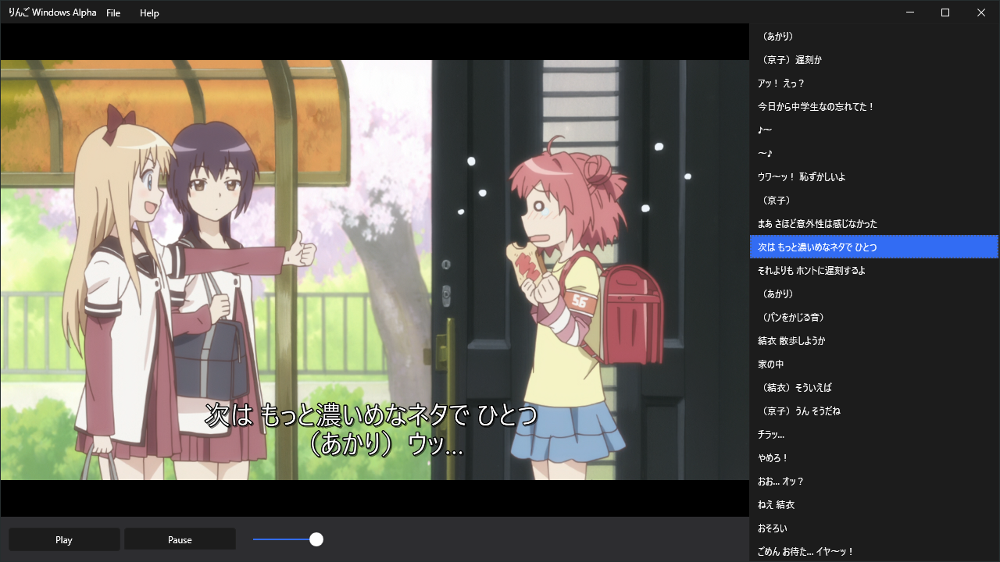

# りんご「RINGO」
 Ringo is a media player created by Mikkel L. Mouridsen ([@Coborax.](https://github.com/Coborax)), for learning languages.
 

## Roadmap
- [x] Support major codecs
- [ ] Export to anki via AnkiConnect
- [ ] Support Yomichan dictionaries
- [ ] Hover over words to see dictionary definition
- [ ] Scan media collection, and load metadata about show (Like kodi)

## Contributing
Pull requests are welcome. For major changes, please open an issue first to discuss what you would like to change.

## Authors and acknowledgment
This project is created by: [@Coborax.](https://github.com/Coborax)

This project is heavily inspired by [Voracious](https://voracious.app/) and [Animebook](https://github.com/animebook/animebook.github.io).

## License
This project is licensed under the [MIT License](https://choosealicense.com/licenses/mit/) - see [LICENSE](LICENSE) for more information.
